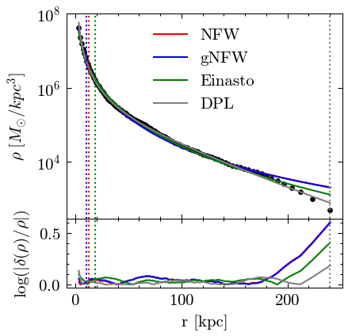
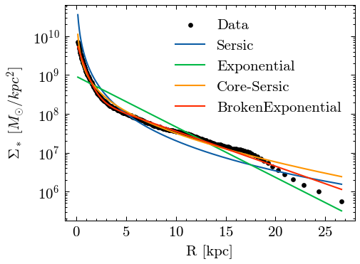
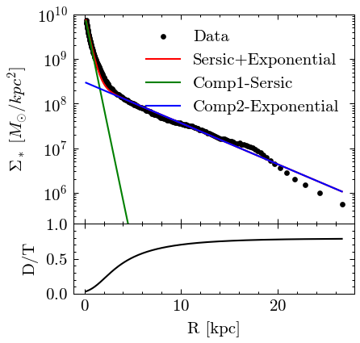

## Introduction
gal1d is a python package for analysing volume or surface density (luminosity) profiles and fitting them with theoretical profiles


## Installation

```
git clone https://github.com/wx-ys/gal1d.git
```
Install this in editable mode.
```
cd gal1d
pip install -e .
```
See [example](example.ipynb) for usage,


## Profiles
analysis a single theoretical profile or a combination of the addition of some of these profiles.
* NFWProfile: a Navarro-Frenk-White (NFW) profile
* GNFWProfile: a generalized NFW profile profile (Kravtsov 1998)
* DoublePowerLawProfile: a 'broken' or double power-law profile (Hernquist 1990; Zhao 1996)
* EinastoProfile: an Einasto profile (Einasto 1965, 1969)
* SersicProfile: a Sersic profile (Sérsic 1963, 1968)
* ExponentialProfile: an exponential profile
* CoreSersicProfile: a core-Sersic profile (Graham et al. 2003; Trujillo et al. 2004)
* BrokenExponentialProfile: a broken exponential profile (Erwin et al. 2008)

...

- MultiProfiles: the combination of some of theoretical profiles by user-defined


## Examples

- Fit dark matter halo density profile:



- Calculate enclosed mass:


- Fit stellar surface density profile:




- Use composite profiles to fit it:




## Maintainers

[@wx-ys](https://github.com/wx-ys).


## License

[MIT](LICENSE) © Shuai Lu

## Acknowledgments
* [pynbody](https://github.com/pynbody/pynbody)
* [pyimfit](https://github.com/perwin/pyimfit)
* [lenstronomy](https://lenstronomy.readthedocs.io/en/latest/)